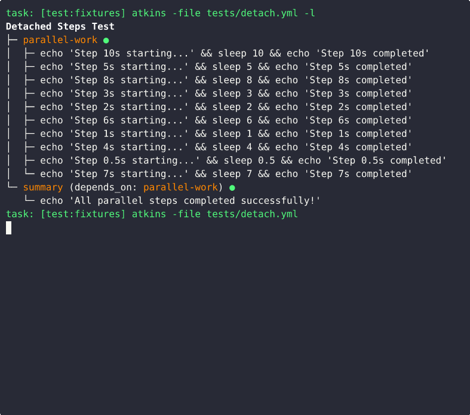

# Atkins CI

## Demo



---

Goals for the project:

- define a JSON/yaml forward execution script
- inspired by GHA, Drone CI, Taskfile
- should allow exec into environment
- should allow exec into docker

The project builds around [titpetric/yamlexpr](https://github.com/titpetric/yamlexpr), providing
yaml support for `for`, `if` and interpolation. The interpolation uses GitHub action syntax for
variables, `${{ ... }}`.

The main problem the project tries to work around is this:

```go
version: '3'

tasks:
  default:
    desc: 'Check last BRZINA message and send reply if needed'
    vars:
      TARGET_NUMBER: '13909'
      TRIGGER_PATTERN: 'BRZINA'
      RESPONSE_MESSAGE: 'brzina'
    cmds:
      - |
        LAST_BRZINA=$(./tp-link-cli sms list --json | jq -r '.[] | select(.content | contains("{{.TRIGGER_PATTERN}}")) | .receivedTime' | head -1)
        LAST_SENT=$(./tp-link-cli sms list --folder=sent --json | jq -r '.[] | select(.to == "{{.TARGET_NUMBER}}") | .sendTime' | head -1)

        echo "Last BRZINA received: $LAST_BRZINA"
        echo "Last response sent: $LAST_SENT"

        if [ -z "$LAST_SENT" ] || [ "$LAST_SENT" -lt "$LAST_BRZINA" ]; then
          ./tp-link-cli sms send {{.TARGET_NUMBER}} "{{.RESPONSE_MESSAGE}}"
          ./tp-link-cli sms send 0038631265642 "Quota router reset after 200G limit."
        else
          echo "Already responded to this message"
        fi
```

While this would arguably be nicer in a bash script (yaml wrapping bash goes hard). Consider the yamlexpr version:

```yaml
trigger_match: BRZINA
target_number: 13909
target_message: brzina

last_inbox_match: $(./tp-link-cli sms list --json | jq -r '.[] | select(.content | contains("${{ trigger_match }}")) | .receivedTime' | head -1)
last_sent_match: $(./tp-link-cli sms list --folder=sent --json | jq -r '.[] | select(.to == "${{ target_number }}") | .sendTime' | head -1)

tasks:
  default:
    desc: "Check last inbox match and send reply if needed"
    if: last_sent_match < last_inbox_match
    cmds:
      - ./tp-link-cli sms send {{.TARGET_NUMBER}} "{{.RESPONSE_MESSAGE}}"
      - ./tp-link-cli sms send 0038631265642 "Quota router reset after 200G limit."
```

The intent is also to consume yaml/json with `$(...)`.

```
inbox_list: $(./tp-link-cli sms list --json)

messages:
  - for: message in inbox_list
    message: ${{ message }}
```

## Design

Options for the runner are:

```
name: string

tasks:
  <name>:
    desc: ...
    cmd: optional
    cmds:
      - <cmd>
      - cmd: <cmd>
```

The alternative is GHA flavored:

```
name: string

jobs:
  <name>:
    runs_on: ubuntu-latest
    container: sourcegraph/scip-go
    steps:
      - uses: (yamlexpr include: if needed)
      - name: step name
        run: <cmd>

    services:
      redis:
        image: redis
        options: >-
          --health-cmd "redis-cli ping" --health-interval 10s --health-timeout 5s --health-retries 5
        ports:
          - 6379:6379
```

And Drone CI flavoured:

```
workspace:
  base: /app

kind: pipeline
name: string

steps:
  - {name, image, pull, commands: [<cmd>...]}
  - ...

services: ((simplify: compose.ci.yml))?
  (( follows compose.yml formatting )).
```

So a summary of the formats is:

- should be documentation friendly (name, desc)
- should provide or include a service description (docker compose, optional)
- should allow to run multiple commands (steps, commands, cmds)
- in case of docker, ideally network env is a docker net, avoiding `ports` definitions

In practice, we need to orchestrate:

- any docker services (with or without `--wait`),
- shell commands, asume json outputs (`docker compose inspect`, `docker compose config`, `jq`, `tool --json`...)
- drone is "flat" in the sense that it just gives you a steps: []step.

Drone is actually the simple approach, as it gives you a file for each
pipeline. Yamlexpr supports include, so the question is, can we compose
multiple pipelines from individual files.

```
name: ...

jobs:
  include: master/*.yml
```

With this, it's desired that each yml file has a root key with the name of the job:

```yaml
test:
  {runs_on, image, container, plugin...}: <val>
  steps: ...
  services: ...
```

So each pipeline will have 1) services, 2) steps, 3) runtime docker environment info (image:...).
The services should be reachable from `cmd/cmds/steps` by it's name, so a docker network is shared.

If steps don't run in a docker env, then they would need to rely on localhost.